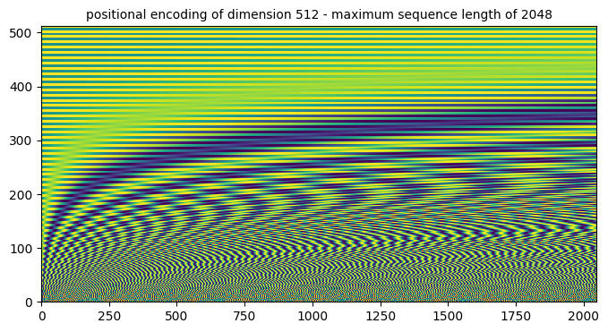
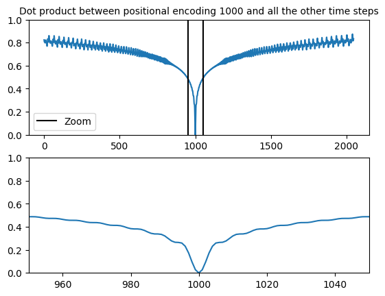

# Overview

Sequential models like(RNNs) were used in many machine learning tasks involving sequence data. Their inherent sequential structure hindered the speed of computation since each step depended on a hidden state from the last time step. Other techniques like passing the ground truth information(teacher forcing) to the input of the next time step were used to speed up training, but these techniques sometimes had a negative effect on the capacity of the model to generalise.

The Attention mechanism was introduced to make these sequence models more robust as they suffered from a vanishing gradient problem relative to the length of the sequence. This Enhanced the performance of sequence to sequence architectures on complex tasks such as machine translation.

The transformer was first introduced in 2017 in the paper (attention is all you need). Replacing the sequence modeling completely by the multi-head self attention mechanism.

# Positional Encodings

The position of words is inherently encoded in the architecture of sequence models since the computation is done in time steps.

    

The position of words is an important piece of information for a language model, as the same word can have a different meaning depending on its position in the sequence; the meaning of the entire phrase can change if this information is not encoded in the model

In the original transformer paper, positional encodings were used to encode this information.

### position vector:

The authors of the original transformer paper proposed a vector $p_t^i$ of size $d$ where $d$ is an even number representing the encoding position.

$p_t^{2k+1} = cos(w_k.t)$     and    $p_t^{2k} = sin(w_k.t)$    where :    $\omega_k = \frac{1}{10000^{2k/d}}$

    

The rows represent the different sentence, each column's rate change is different. This ensures that the difference between two time steps stays consistent accross the sequences. And also captures the difference between two words on different parts of the sequence (similarity between positions).

The dimension $d$ of the positional encodings vectors is the same as the dimension of the embedding. This information is added to the original word representation.

The authors of the original paper stated that the sinusoidal(fixed) way of encoding positions of the input sentence may allow for extrapolation to longer sequences at inference time. (as opposed to models relying on learned / absolute positions. BERT for examples learns a vector for each of the possible positions.)

It was also hypothesized that the positional encodings also allow the model to learn to attend by relative position.(phase shifting is used to evaluate the model's ability in recognizing relative positions, MLMs using APES(absolute positional embeddings) perform poorly on phase shifting tasks))

In fact $pos_{i+k}$ can be represented linearily with $pos_i$ independentely of the time step ($pos_{i+k} = D^k.pos_i$ Where $D^k$ is a block diagonal matrix composed of $d_{model/2}$ transposed rotation matrices of size 2x2).

the distance between neighboring time-steps and changes nicely with time. Here is an illustration from the tensorflow official impelmentation

    

